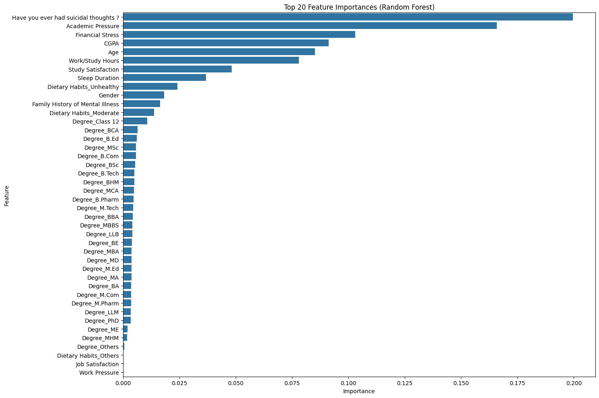
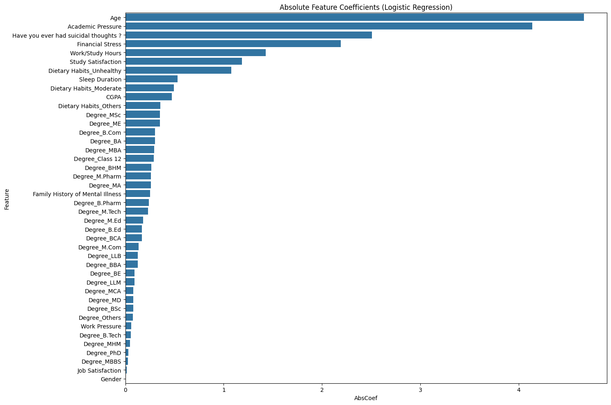
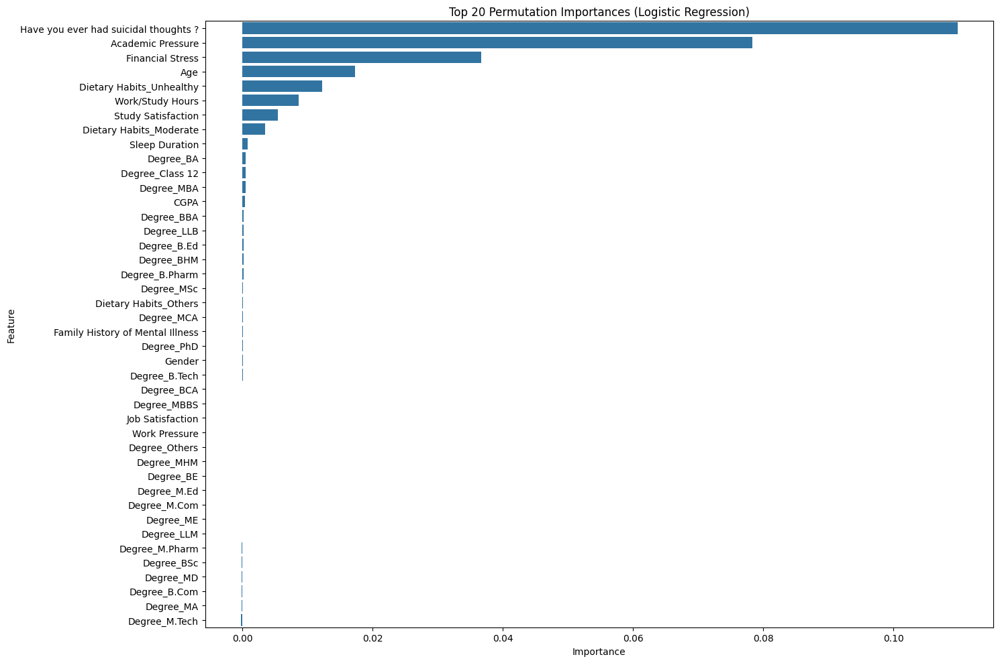

# Exploratory data analysis

The raw dataset contains 27,901 survey records and 18 columns. Three records have
a missing `Financial Stress` value and no exact duplicate rows were found. The
binary target is moderately imbalanced: 58.5% positive and 41.5% negative.

This document preserves the visual outputs from the original EDA notebook as
standalone, GitHub-renderable assets. The executable analysis remains in
[`notebooks/01_eda_and_preprocessing.ipynb`](../notebooks/01_eda_and_preprocessing.ipynb).

## Random Forest feature importance

The strongest model-associated features were previous suicidal thoughts,
academic pressure, financial stress, CGPA, age, and work/study hours. Feature
importance describes predictive association in this dataset; it does not establish
causality or clinical significance.

## Logistic Regression coefficients

Coefficient magnitudes were calculated after numeric scaling, making their relative
magnitudes easier to inspect. Categorical levels still depend on their one-hot
reference categories.

## Permutation importance

Permutation importance produced a similar ranking for the leading features. These
plots were generated on training data in the original coursework and should be
treated as exploratory rather than as holdout performance evidence.
